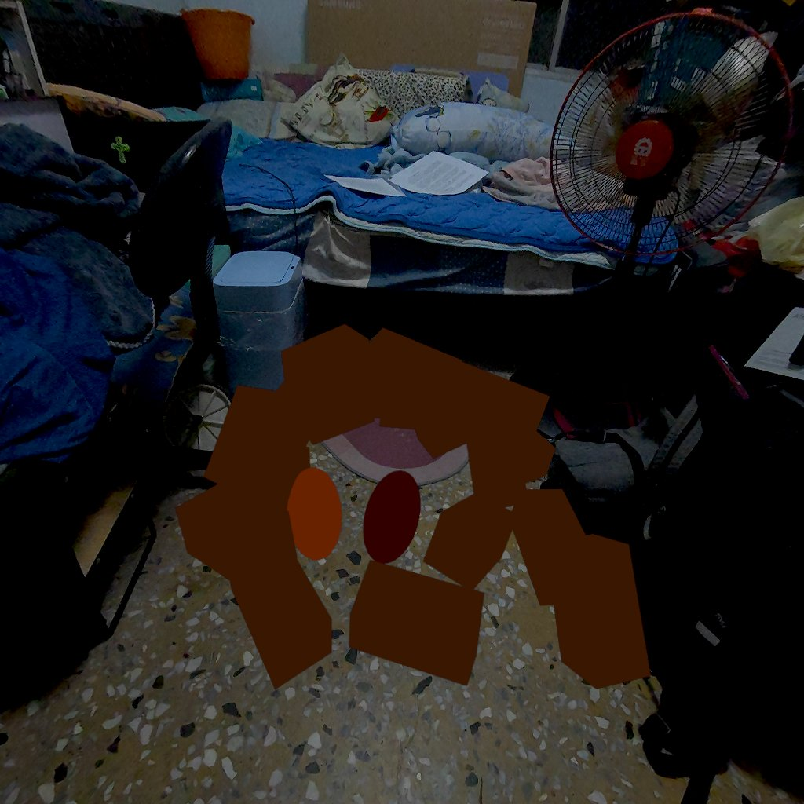

# KongYao

KongYao 是一個簡易的混合實境 (MR) 魔法炕窯系統示範專案。使用者可以在室內透過魔法手勢與 Palm Menu 在虛擬世界中生火、堆窯、並利用餘溫烤食物，模擬真實堆窯流程，同時維持安全（避免使用火魔法導致一氧化碳中毒的情境）。

**重點功能**
- 使用 Palm Menu 與手勢釋放魔法
- 四種魔法：火／水／土／風
- 火焰附著系統（火 + 煙）與餘溫機制，可用於烘烤地瓜
- 可生成與堆疊土塊，製作臨時炕窯
- 支援 Meta Quest 平台的效果與體驗優化

## 快速開始
1. 使用 Unity 開啟此專案資料夾。
2. 建議使用 Unity 6000.4 LTS（或更新版本）並安裝下列套件：
	 - `Input System`
	 - `XR Interaction Toolkit`
	 - `TextMesh Pro`
	 - `Universal Render Pipeline`
3. 在 Unity 中開啟場景（範例場景位於 `Assets/Scenes/Main`），將專案部署到 Meta Quest 裝置進行測試。

> 注意：本專案使用 Meta Quest 的 Effect Mesh，請確認目標設備或房間模型支援所需效果，否則部分視覺效果可能受限。

## 操作與控制
- **Palm Menu**：將左手手掌抬起或朝向自己時會顯示選單，用於切換魔法或生成物品。

- **發動魔法**：將右手五指張開並向前伸出以釋放當前選擇的魔法。

### 魔法說明
- **火魔法**：發射火球，在碰撞位置建立火焰附著系統（包含火與煙）。
- **水魔法**：熄滅火焰並降低溫度，可移除火焰附著系統。
- **土魔法**：生成可拾取的土塊，可用來堆砌炕窯或覆蓋火焰（土塊不具降溫效果）。
- **風魔法**：對火焰附著系統使用可增加火勢（小火 / 中火 / 大火），延長餘溫持續時間。

### 火焰附著系統
- 當火被土塊壓熄後，會留下「煙」作為餘溫，餘溫會隨時間衰減。

- **地瓜（Sweet Potato）**：透過 Palm Menu 生成，
	- 遇到火焰會直接燒焦
	- 使用餘溫可將其烤熟，餘溫烤太久則會燒焦

## 場景與資源
- **食材**：可從 Palm Menu 生成地瓜進行烘烤。
- **土塊**：由土魔法生成，可拾取、移動與堆疊。
- **特效**：火、煙與光照效果主要採用 Unity 粒子系統與 Shader（URP 建議）。

## 開發與建置建議
- Build Target 設為 Meta Quest，並在 XR Plugin Management 中啟用相應的 XR Provider（OpenXR）。
- 測試及部署流程：
	1. 在 Build Settings 選擇 Meta Quest，將場景加入 Build 列表。
	2. 設定 XR Plugin 與權限。
	3. 使用 USB 或 ADB 推送至 Meta Quest 測試。
- 若遇效能問題：降低粒子數量、精簡特效、調整 LOD 與光照設定。

## 已知限制與注意事項
- 土塊僅做為覆蓋與擺放，設計上不會主動降低燃燒溫度。
- 若目標環境缺少房間模型或 Effect Mesh 支援，魔法效果不會附著產生效果。

## 使用的 Asset Resources
- [Free Fire VFX - URP](https://assetstore.unity.com/packages/vfx/particles/fire-explosions/free-fire-vfx-urp-266226)
- [Magic Effects FREE](https://assetstore.unity.com/packages/vfx/particles/spells/magic-effects-free-247933)